## 👋 About me

I'm a **Technical Product Manager who builds**. I define requirements, plan and manage sprints, coordinate remote teams and review their work every day, and I contribute hands-on on web and mobile when the project needs it. My strength lies in aligning user needs, technical feasibility and business value.

## 🚀 What I'm working on

- 🎹 **[teclas.ar](https://teclas.ar)**: my own product, a platform for music teachers and academies *(in development)*
- 🧭 **Project delivery** at [Dandelion Labs](https://dandelionlabs.io) and its post-quantum cryptography practice, QuantaKrypto
- ⚡ **[BitByBit](https://github.com/bitbybit-ar)**: open-source, Bitcoin-based apps. 🥇🥇 Two 1st places at La Crypta's Lightning Hackathons 2026

## 🤖 How I work

- 📚 **Spec-driven**: well-organized docs that both people and AI agents work from
- 🧪 **Test-first**: tests for everything, with CI checks on every pull request
- 🧠 **AI-assisted, human-verified**: AI coding agents (Claude Code, Codex), always checked against real code and data

## 🛠️ Tech stack

  

## 📈 Activity

  

  <picture>
    <source media="(prefers-color-scheme: dark)" srcset="https://raw.githubusercontent.com/analiaacostaok/analiaacostaok/output/github-snake-dark.svg" />
    <source media="(prefers-color-scheme: light)" srcset="https://raw.githubusercontent.com/analiaacostaok/analiaacostaok/output/github-snake.svg" />
    
  </picture>

## 🤝 Let's connect

Always open to discussing new ideas, collaborations and challenging projects.

